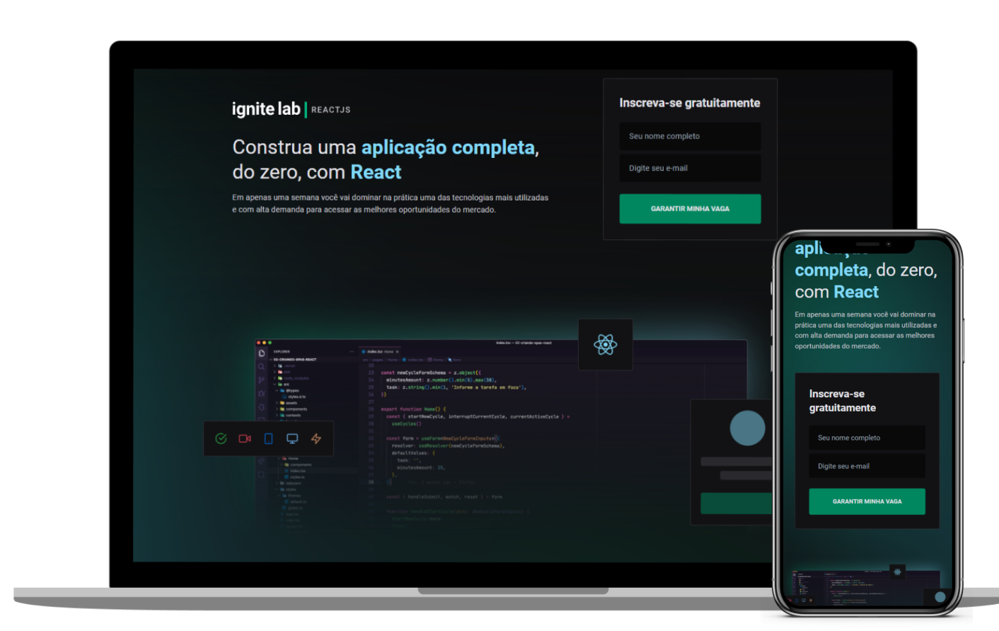

<h1 align="center">
        
</h1>

<p align="center">
  
</p>

<br>

## 💻 Projeto

  Plataforma de estudos desenvolvida durante o Ignite Lab.
  
    Adicionado - Responsividade 
  
  - [Acesse o IgniteLab](https://ignite-lab-react-two.vercel.app/)

## 🖼 Layout

Veja o layout no link abaixo:
  - [Feedget - Figma](https://www.figma.com/community/file/1120711251998877938)

## :rocket: Tecnologias

Esse projeto foi desenvolvido com as seguintes tecnologias:

- [Vitejs](https://vitejs.dev/)
- [Apollo](https://www.apollographql.com/)
- [GraphCMS](https://graphcms.com/)
- [ReactJS](https://reactjs.org)
- [TypeScript](https://www.typescriptlang.org/)
- [Tailwind CSS](https://tailwindcss.com/)

## 👨‍💻 Instrutor

- [Diego Fernandes](https://github.com/diego3g) by [Rocketseat](https://www.rocketseat.com.br/)

## 🤞 Iniciando o projeto

**Clone o projeto e acesse a pasta**

```bash
git clone https://github.com/vinive/ignite-lab-react.git && cd ignite-lab-react
```

**Siga os passos**

```bash
# Instale as dependências
$ npm install

# Inicie a aplicação
$ npm run dev
```

 
Desenvolvido com 💚 por [Vinicius](https://github.com/vinive) 👻
